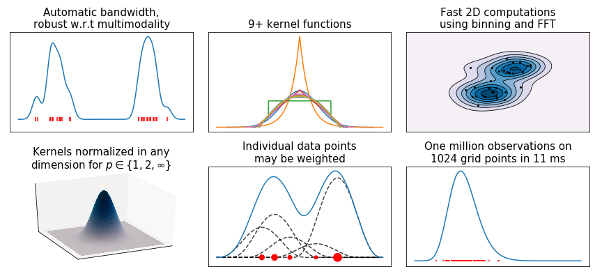
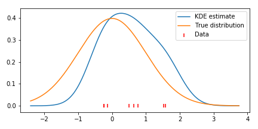

[](https://travis-ci.org/tommyod/KDEpy) [](https://ci.appveyor.com/project/tommyod/kdepy) [](http://kdepy.readthedocs.io/en/latest/?badge=latest) [](https://badge.fury.io/py/KDEpy)
---------

# [KDEpy](https://kdepy.readthedocs.io/en/latest/)

## About

This Python package implements various kernel density esimators (KDE).
The long-term goal is to support state-of-the-art KDE algorithms, and eventually have the most complete implementation in the scientific Python universe.
As of now, three algorithms are implemented through the same API: [`NaiveKDE`](https://kdepy.readthedocs.io/en/latest/API.html#naivekde), [`TreeKDE`](https://kdepy.readthedocs.io/en/latest/API.html#treekde) and [`FFTKDE`](https://kdepy.readthedocs.io/en/latest/API.html#fftkde).



*The code generating the above graph is found in [KDEpy/examples.py](https://github.com/tommyod/KDEpy/blob/master/KDEpy/examples.py).*

## Installation

KDEpy is available through [PyPI](https://pypi.org/project/KDEpy/), and may be installed using `pip`:

```bash
pip install KDEpy
```

## Example code and documentation

Below is an example using NumPy as `np` and `scipy.stats.norm` to plot a density estimate.
From the code below, it should be clear how to set the *kernel*, *bandwidth* (variance of the kernel) and *weights*.
See the [documentation](https://kdepy.readthedocs.io/en/latest/) for more examples.

```python
from KDEpy import NaiveKDE
data = norm(loc=0, scale=1).rvs(2**3)
estimator = NaiveKDE(kernel='gaussian', bw='silverman')
x, y = estimator.fit(data, weights=None).evaluate()
plt.plot(x, y, label='KDE estimate')
```


The package consists of three algorithms. Here's a brief explanation:
- [`NaiveKDE`](https://kdepy.readthedocs.io/en/latest/API.html#naivekde) - A naive computation. Supports N-dimensional data, variable bandwidth, weighted data and many kernel functions. Very slow on large data sets.
- [`TreeKDE`](https://kdepy.readthedocs.io/en/latest/API.html#treekde) - A tree-based computation. Supports the same features as the naive algorithm, but is faster at the expense of small inaccuracy when using a kernel without finite support.
- [`FFTKDE`](https://kdepy.readthedocs.io/en/latest/API.html#fftkde) - A fast, FFT-based computation for 1D and 2D data. Supports weighted data and many kernels, but not variable bandwidth. Must be evaluated on an equidistant grid, the finer the grid the higher the accuracy.

## Issues and contributing

### Issues

If you are having trouble using the package, please let me know by creating an [Issue on GitHub](https://github.com/tommyod/KDEpy/issues) and I'll get back to you.

### Contributing

Whatever your mathematical and Python background is, you are very welcome to contribute to KDEpy.
To contribute, clone the project, create a branch and submit and Pull Request.
Please follow these guidelines:
- Import as few external dependencies as possible.
- Use test driven development, have tests and docs for every method.
- Cite literature and implement recent methods.
- Unless it's a bottleneck computation, readability trumps speed.
- Employ object orientation, but resist the temptation to implement
  many methods -- stick to the basics.
- Follow PEP8.
