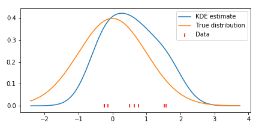
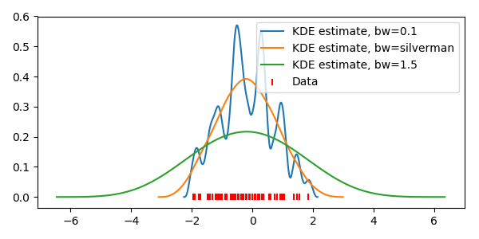

[](https://travis-ci.org/tommyod/KDEpy)
[](http://kdepy.readthedocs.io/en/latest/?badge=latest)
[](https://badge.fury.io/py/KDEpy)
---------

# [KDEpy](https://kdepy.readthedocs.io/en/latest/)

## About

This Python package which implements various kernel density esimators (KDE).
The goal is to support state-of-the-art KDE, and eventually have the most complete implementation in the Python universe.
As of now, three algorithms are implemented: `NaiveKDE`, `TreeKDE` and `FFTKDE`.
Some highlights of the package include:
- Choice between 9+ kernel functions in any p-norm. Normalized for common values of p.
- Several methods for automatic bandwidth selection, including the Improved Sheather Jones algorithm (2010).
- All KDEs support weighted data, some support non-equidistant grids.
- A very fast 1D implementation of the `FFTKDE` can deal with tens of millions of data points.

## Installation

KDEpy is available on [PyPI](https://pypi.org/project/KDEpy/), and may be installed using `pip`:

```bash
pip install KDEpy
```

## Example code and documentation

Below is an example using NumPy as `np` and `scipy.stats.norm` to plot a density estimate. See the [documentation](https://kdepy.readthedocs.io/en/latest/) for more examples.

```python
from KDEpy import NaiveKDE
np.random.seed(42)
data = norm(loc=0, scale=1).rvs(2**3)
x, y = NaiveKDE(kernel='gaussian', bw='silverman').fit(data).evaluate()
plt.plot(x, y, label='KDE estimate')
```


The package consists of three algorithms:

- `NaiveKDE` - A naive computation. Supports N-dimensional data, variable bandwidth, weighted data and many kernel functions. Slow on large data sets.
- `TreeKDE` - A tree-based computation. Supports the same features as the naive algorithm, but is faster at the expense of small inaccuracy when using a kernel without finite support.
- `FFTKDE` - A fast, FFT-based computation on univariate data. Supports weighted data and many kernels, but not variable bandwidth. Must be evaluated on an equidistant grid, the finer the grid the higher the accuracy.

```python
data = norm(loc=0, scale=1).rvs(2**6)
for bw in [0.1, 'silverman', 1.5]:
    x, y = FFTKDE(kernel='triweight', bw=bw).fit(data).evaluate()
    plt.plot(x, y, label=f'KDE estimate, bw={bw}')
```


## Contributing

Whatever your mathematical and Python background is, you are very welcome to contribute to KDEpy.
I hope to write a short tutorial on how to contribute.
For the time being, open an *Issue* if you would like to contribute but you are unsure how to.

## Milestones

The list below roughly shows what needs to be done.

- [X] univariate BaseKDE (todo: check if more common code can be moved)
- [X] univariate NaiveKDE
- [X] univariate TreeKDE
- [X] univariate FFTKDE (implement linbin even faster in cython)
- [ ] univariate DiffusionKDE
- [X] Refactor kernel funcs - add solver for effective bandwidth

- [X] Implement univariate, fixed bandwidth KDEs naively
- [X] Implement **weighted**, fixed bandwidth, univariate KDEs naively
- [X] Implement variable bandwidth KDEs naively
- [X] Implement TreeKDE, test against other implementations
- [X] Implement Scott and Silverman rules for bandwidth selection
- [ ] Make sure that speed and functionally matches `statsmodels`, `scikit-learn` and `scipy`
- [ ] Implement methods taking care of boundaries
- [X] Make sure TreeKDE works without finite support too

## Misc

### General guidelines for this project

I hope to follow these guidelines for this project:
- Import as few external dependencies as possible, ideally only NumPy.
- Use test driven development, have tests and docs for every method.
- Cite literature and implement recent methods.
- Unless it's a bottleneck computation, readability trumps speed.
- Employ object orientation, but resist the temptation to implement
  many methods - stick to the basics.
- Follow PEP8

---------------


# Theory

# Existing implementations

## Implementations in Python

### Implementations in conda packages

- `sklearn/neighbors/kde.py`
- `scipy/stats/kde.py`
- `statsmodels/nonparametric/*`
- `seaborn/distributions.py`

### Other Python implementations

- https://github.com/cooperlab/AdaptiveKDE
- https://github.com/tillahoffmann/asymmetric_kde
- http://pythonhosted.org/PyQt-Fit/KDE_tut.html
- https://github.com/Daniel-B-Smith/KDE-for-SciPy

## Implementations in other languages

- [MATLAB: adaptive kernel density estimation in one-dimension](https://se.mathworks.com/matlabcentral/fileexchange/58309-adaptive-kernel-density-estimation-in-one-dimension?s_tid=gn_loc_drop)
- [MATLAB: Kernel Density Estimator for High Dimensions](http://se.mathworks.com/matlabcentral/fileexchange/58312-kernel-density-estimator-for-high-dimensions)


# References

## Books

- Silverman, B. W. Density Estimation for Statistics and Data Analysis. Boca Raton: Chapman and Hall, 1986. -- Page 99 for reference to kd-tree
- Wand, M. P., and M. C. Jones. Kernel Smoothing. London ; New York: Chapman and Hall/CRC, 1995. -- Page 182 for computation using linbin and fft

## Wikipedia and other articles

- [Wiki - Kernel density estimation](https://en.wikipedia.org/wiki/Kernel_density_estimation)
- [Wiki - Variable kernel density estimation](https://en.wikipedia.org/wiki/Variable_kernel_density_estimation)
- [Wiki - Kernel (statistics)](https://en.wikipedia.org/wiki/Kernel_(statistics))
- [Histograms and kernel density estimation KDE 2](https://mglerner.github.io/posts/histograms-and-kernel-density-estimation-kde-2.html?p=28)
- [Jakevdp - Kernel Density Estimation in Python](https://jakevdp.github.io/blog/2013/12/01/kernel-density-estimation/)

## Papers

- [arXiv - Efficient statistical classification of satellite
measurements](https://arxiv.org/pdf/1202.2194.pdf)
- [arXiv - UNIFIED TREATMENT OF THE ASYMPTOTICS OF ASYMMETRIC KERNEL DENSITY ESTIMATORS](https://arxiv.org/pdf/1512.03188.pdf)
- [arXiv - A Review of Kernel Density Estimation with Applications to Econometrics](https://arxiv.org/pdf/1212.2812.pdf)
- [A Reliable Data-Based Bandwidth Selection Method for Kernel Density Estimation](https://www.researchgate.net/profile/Simon_Sheather/publication/224817413_A_Reliable_Data-Based_Bandwidth_Selection_Method_for_Kernel_Density_Estimation/links/0046352bc8b276ba1c000000/A-Reliable-Data-Based-Bandwidth-Selection-Method-for-Kernel-Density-Estimation.pdf)
- [KERNEL DENSITY ESTIMATION VIA DIFFUSION](https://projecteuclid.org/download/pdfview_1/euclid.aos/1281964340)
- [Variable Kernel Density Estimation](https://projecteuclid.org/download/pdf_1/euclid.aos/1176348768)
- [ Bayesian Approach to Bandwidth Selection for Multivariate Kernel Density Estimation](https://robjhyndman.com/papers/mcmckernel.pdf)
- [BOOTSTRAP BANDWIDTH SELECTION IN KERNEL DENSITY ESTIMATION](http://www.ism.ac.jp/editsec/aism/pdf/056_1_0019.pdf)
- [Kernel Estimator and Bandwidth Selection for Density and its Derivatives](https://cran.r-project.org/web/packages/kedd/vignettes/kedd.pdf)

## Misc

- [Variable Kernel Density Estimation - 20 slides](https://pdfs.semanticscholar.org/96c6/d421342631e3005cc85a330fedc729c8298b.pdf)
- [Lecture Notes on Nonparametrics - 25 pages](https://pdfs.semanticscholar.org/2c36/60a1844f55935f798b10a48197a665d1a825.pdf)
- [APPLIED SMOOTHING TECHNIQUES - Part 1: Kernel Density Estimation - 20 pages](http://staff.ustc.edu.cn/~zwp/teach/Math-Stat/kernel.pdf)
- [Kernel density estimation - 26 slides](http://research.cs.tamu.edu/prism/lectures/pr/pr_l7.pdf)
- [Density Estimation - 32 pages](http://www.stat.cmu.edu/~larry/=sml/densityestimation.pdf)

# Computation

- *An Algorithm for Finding Best Matches in Logarithmic Expected Time*, Friedman et al, DOI 10.1145/355744.355745

https://www.ics.uci.edu/~ihler/code/kde.html

http://www-stat.wharton.upenn.edu/~lzhao/papers/MyPublication/Fast_jcgs.2010.pdf


https://indico.cern.ch/event/397113/contributions/1837849/attachments/1213965/1771772/main.pdf

http://www.cs.ubc.ca/~nando/papers/empirical.pdf

http://iopscience.iop.org/article/10.1088/1742-6596/762/1/012042/pdf

https://arxiv.org/pdf/1206.5278.pdf


https://www.researchgate.net/publication/228773329_Insights_on_fast_kernel_density_estimation_algorithms
