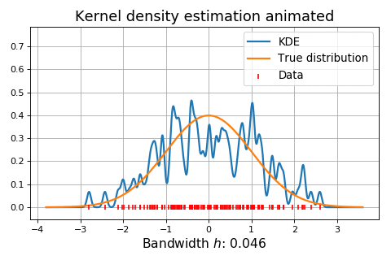

Bandwidth
=========

It is widely accepted in the literature that the choice of bandwidth :math:`h` is more important than the choice of kernel :math:`K`.
Consider a kernel density estimator based on :math:`N` points, weighting the
data points :math:`x_i` with weights :math:`w_i`.
We require that :math:`\sum_i w_i = 1`.

.. math::

   \widehat{f}(x) = \sum_{i=1}^{N} w_i K \left( \left \| x - x_i \right \|_p \right)

To extend the equation above we divide by a scaling factor :math:`h` called the *bandwidth*.
When dividing with :math:`h`, every dimension :math:`d` is stretched, so we must
re-scale with :math:`h^d` to ensure that :math:`\int \widehat{f}(x) \, dx`
evaluates to unity.

.. math::

   \widehat{f}(x) = h^{-d} \sum_{i=1}^{N} w_i K \left( \frac{\left \| x - x_i \right \|_p}{h} \right)

We will now briefly explain two ways to find a good :math:`h`.

.. note::
   In KDEpy, the bandwidth :math:`h` is the standard deviation of the kernel function.
   This is because the implementation contains many kernels, some with bounded support and some without, and using the standard deviation to quantify the bandwidth allows easy comparison.

Normal reference rules
----------------------

If the data is **unimodal and close to normal**, *silverman's rule of thumb* may be used.
It's computationally very fast, but derived by assuming that the true density is normal.
This is somewhat paradoxal, since if we knew that the data was truly normal it would render a kernel density estimator unnecessary.

An example using ``bw='silverman'`` is shown in the code snippet below.

.. plot::
   :include-source:

   from KDEpy import FFTKDE
   from scipy.stats import norm

   # Generate a distribution and some data
   dist = norm(loc=0, scale=1)
   data = dist.rvs(2**8) # Generate 2**8 points

   # Compute density estimates using 'silverman'
   x, y = FFTKDE(kernel='gaussian', bw='silverman').fit(data).evaluate()
   plt.plot(x, y, label='KDE /w silverman')

   plt.plot(x, dist.pdf(x), label='True pdf')
   plt.grid(True, ls='--', zorder=-15); plt.legend();

The Improved Sheather-Jones algorithm
-------------------------------------

If much data is available and the data is **far from normal or multimodal**, the *Improved Sheather Jones* (ISJ) algorithm may be used.
The Improved Sheather-Jones algorithm is a *plug-in selector*.
The mean integrated square error (MISE) is given by

.. math::

  \operatorname{MISE} (h) = \mathbb{E}\int \left ( \hat{f}(x;h) - f(x) \right )^2 \, dx.

The ISJ algorithm attempts to find :math:`h` to minimize the asymptotic mean
integrated square error (AMISE), which depends on the unknown quantity :math:`\left \| f''(x) \right \|^2`.
Using a recursive formula, this is accomplished by computing a sequence of estimates.
See the paper by Botev et al in the :ref:`literature` for details.

.. plot::
   :include-source:

   from KDEpy import FFTKDE
   from scipy.stats import norm

   # Generate a distribution and some multimodal data
   dist1 = norm(loc=0, scale=1)
   dist2 = norm(loc=10, scale=1)
   data = np.hstack([dist1.rvs(2**8), dist2.rvs(2**8)])

   # Compute density estimates using 'silverman'
   x, y = FFTKDE(kernel='gaussian', bw='silverman').fit(data).evaluate()
   plt.plot(x, y, label='KDE /w silverman')

   # Compute density estimates using 'ISJ' - Improved Sheather Jones
   y = FFTKDE(kernel='gaussian', bw='ISJ').fit(data).evaluate(x)
   plt.plot(x, y, label='KDE /w ISJ')

   plt.plot(x, (dist1.pdf(x) + dist2.pdf(x))/2, label='True pdf')
   plt.grid(True, ls='--', zorder=-15); plt.legend();
