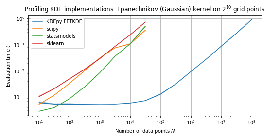
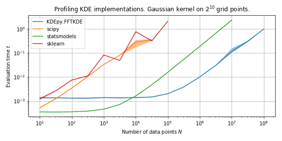
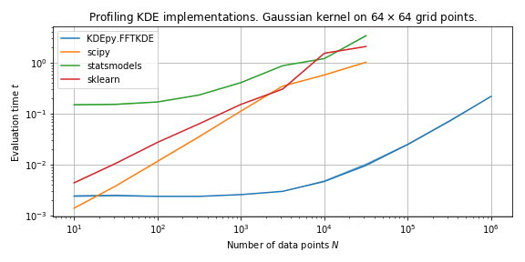
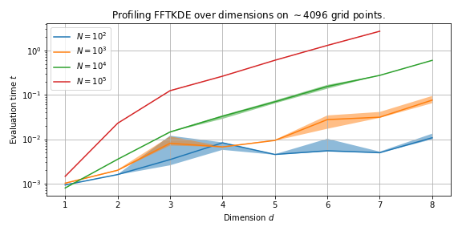

Comparison
==========

.. currentmodule:: KDEpy

In this section we will compare the fast :class:`~KDEpy.FFTKDE.FFTKDE` with three popular implementations.

- ``scipy`` - `scipy.stats.gaussian_kde <https://docs.scipy.org/doc/scipy/reference/generated/scipy.stats.gaussian_kde.html>`_
- ``sklearn``- `sklearn.neighbors.KernelDensity <http://scikit-learn.org/stable/modules/generated/sklearn.neighbors.KernelDensity.html>`_
- ``statsmodels`` - `statsmodels.nonparametric.kde.KDEUnivariate <https://www.statsmodels.org/stable/generated/statsmodels.nonparametric.kde.KDEUnivariate.html>`_ / `statsmodels.nonparametric.kernel_density.KDEMultivariate <https://www.statsmodels.org/stable/generated/statsmodels.nonparametric.kernel_density.KDEMultivariate.html>`_

This page is inspired by `Kernel Density Estimation in Python <https://jakevdp.github.io/blog/2013/12/01/kernel-density-estimation/>`_, where Jake VanderPlas (the original author of the ``sklearn`` implementation) compared kernel density estimators in 2013.

.. note::

   Times will vary from computer to computer, and should only be used to compare the relative speed of the algorithms.
   The processor used here is an Intel Core i5-6400 CPU.

The graph above shows the difference in speed when using an Epanechnikov kernel.

Feature summary
---------------

The table below summarizes the features available across the libraries.

+----------------------------------+--------------+----------+-------------+--------------+
| Feature / Library                | scipy        | sklearn  | statsmodels | KDEpy.FFTKDE |
+==================================+==============+==========+=============+==============+
| Number of kernels                | 1 (gauss)    | 6        | 7 (6 slow)  |      9       |
+----------------------------------+--------------+----------+-------------+--------------+
| Number of dimensions             | Any          | Any      |  Any        |     Any      |
+----------------------------------+--------------+----------+-------------+--------------+
| Weighted data points             | No           | No       |  Non-FFT    |   **Yes**    |
+----------------------------------+--------------+----------+-------------+--------------+
| Automatic bandwidth              | NR           | None     |   NR, CV    |  NR, ISJ     |
+----------------------------------+--------------+----------+-------------+--------------+
| Time  :math:`N=10^6`             | 42 s         | 22 s     |   0.27 s    |  **0.01 s**  |
+----------------------------------+--------------+----------+-------------+--------------+
| Time  :math:`N=10^2 \times 10^2` | 0.5 s        | 1.6 s    |   1.3 s     |  **0.005 s** |
+----------------------------------+--------------+----------+-------------+--------------+

The choice of kernel is typically not important, but it might be nice to experiment with different functions.
Most users will be interested in 1D or 2D estimates, but it's assuring to know that every implementation generalizes to arbitrary dimensions :math:`d`.
Being able to weight each data point individually *and* use a fast algorithm is a great benefit of :class:`~KDEpy.FFTKDE.FFTKDE`, which is not found in the other libraries.
``statsmodels`` implements a fast algorithm for unweighed data using the Gaussian kernel in 1D, but everything else runs using a naive algorithm, which is many orders of magnitude slower.

Automatic bandwidth selection is not available out-of-the-box in ``sklearn``, but every other implementation has one or more options.
Normal reference rules (NR) assume a normal distribution when selecting the optimal bandwidth, cross valiation (CV) minimizes an error function and the improved Sheather-Jones (ISJ) algorithm provides an asymptotically optimal bandwidth as the number of data points :math:`N \to \infty`.

The times for the one-dimensional :math:`N = 10^6` data points were computed taking the median of 5 runs.
The kernel was Gaussian and the number of grid points were :math:`n=2^{10}`.
The times for the 2D :math:`N=10^2 \times 10^2` data points are also based on the median of 5 runs using a Gaussian kernel.

Speed in 1D
-----------

We run the algorithms 20 times on normally distributed data and compare the medians of the running times.
The plot below compares the speed of the implementations with a **Gaussian kernel**.
The 1D ``statsmodels`` implementation uses a similar algorithm when the kernel is Gaussian, and the performance is therefore somewhat comparable.

:class:`~KDEpy.FFTKDE.FFTKDE` is slower initially because it solves a non-linear equation to obtain a support threshold for the Gaussian kernel (which does not have finite support).
This is a constant cost, and as :math:`N \to \infty` it the algorithm is orders of magnitude faster than the competitors.

Switching to the **Epanechnikov kernel** (scipy falls back to Gaussian, since it only implements this kernel) the picture is very different.
:class:`~KDEpy.FFTKDE.FFTKDE` knows the support and does not solve an equation, while ``statsmodels`` is now forced to use a naive algorithm.
The difference is tremendous.

Speed in 2D
-----------

We run the 2D algorithms 20 times on normally distributed data and compare medians of the running times.
:class:`~KDEpy.FFTKDE.FFTKDE` is fast because of the underlying algorithm -- it implements a :math:`d`- dimensional linear binning routine and uses :math:`d`-dimensional convolution.

Speed as dimension increases
----------------------------

We will now look at how :class:`~KDEpy.FFTKDE.FFTKDE` performs as the dimensionality of the data increases.
The plot below shows how speed is affected as the dimension :math:`d` increases across different number of data points :math:`N`.
The running time increases exponentially with :math:`d`, and this is no surprise as the binning routine has a theoretical runtime :math:`\mathcal{O}(N 2^d )`.

The :math:`N`-dimensional binning routine has runtime :math:`\mathcal{O}(N 2^d)`, and the convolution (using FFT if needed) has runtime :math:`n \log n`, where :math:`n` is the number of grid points.
The runtime of the complete algorithm is :math:`\mathcal{O}\left( N2^d + n \log n\right)`.
