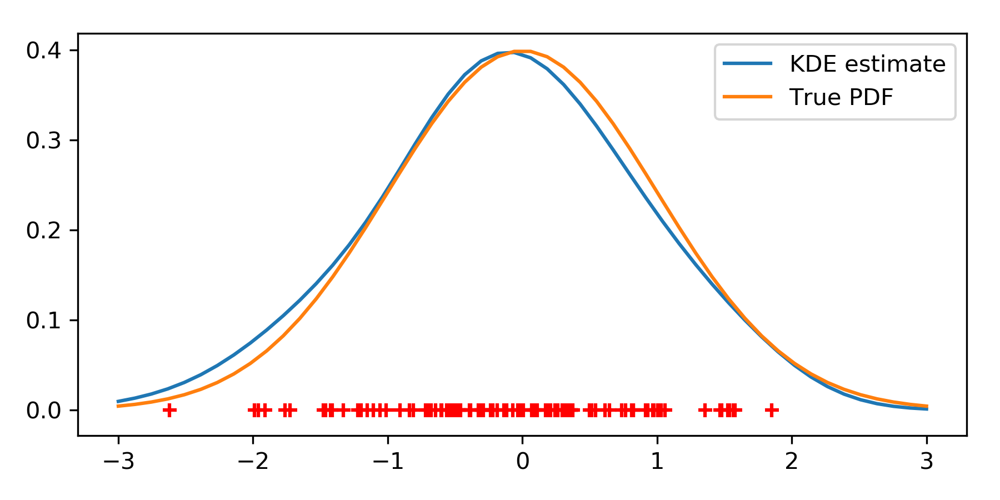

.. KDEpy documentation master file, created by
   sphinx-quickstart on Sat Mar 31 09:23:26 2018.
   You can adapt this file completely to your liking, but it should at least
   contain the root `toctree` directive.

KDEpy
=====

KDEpy implements univariate kernel density estimators.

Highlights
----------

KDEpy is a Python library for kernel density estimation.

Currently, the following features are implemented:

* **Many kernels**: There are 10 kernel functions implemented.
* **Weighted KDE**: The user may weight the data.
* **Weighted KDE**: The user may weight the data.

Minimal working example
-----------------------

Here's a minimal working example::

    >>> from KDEpy import KDE
    >>> import numpy as npmake 
    >>> from scipy.stats import norm
    >>> data = norm(loc=0, scale=1).rvs(100)
    >>> x = np.linspace(-3, 3)
    >>> y = KDE(kernel='gaussian', bw=0.5).fit(data).evaluate(x)

It's really that simple.

Table of contents
-----------------

.. toctree::
   :maxdepth: 2

   intro_kde
   notebook.ipynb

Contribute
----------

You are very welcome to contribute.
To do so, please go to GitHub.

Indices and tables
------------------

* :ref:`genindex`
* :ref:`modindex`
* :ref:`search`
